# Using Debug Info from `pmdsky-debug`
- [Using Debug Info from `pmdsky-debug`](#using-debug-info-from-pmdsky-debug)
  - [Ghidra](#ghidra)
    - [Symbols](#symbols)
    - [C headers (types and function signatures)](#c-headers-types-and-function-signatures)
      - [Applying types manually](#applying-types-manually)
      - [Enums](#enums)
        - [Workaround for enums in struct fields](#workaround-for-enums-in-struct-fields)
      - [Bitfields](#bitfields)
    - [Subsequent imports](#subsequent-imports)
  - [No$GBA](#nogba)

## Ghidra
Ghidra can load both symbols and C source code. These instructions assume a specific Ghidra setup. See the preceding steps in [Setting up Ghidra for _Pokémon Mystery Dungeon: Explorers of Sky_](ghidra-setup.md) first.

### Symbols
1. Download `symbols-ghidra.zip` from the [latest release package](https://github.com/UsernameFodder/pmdsky-debug/releases/latest) and extract the archive.
2. In the Ghidra code browser, open the script manager (Window > Script Manager in the menu, or by clicking the image in the top toolbar).
3. Search for "ImportSymbolsScript.py".

   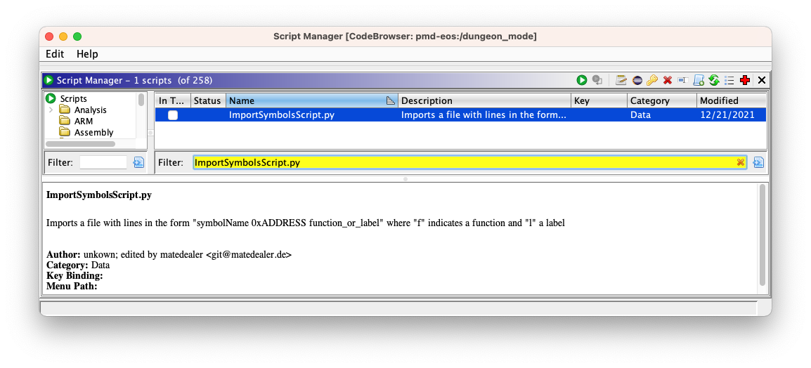

4. When you run the script, it will open a file picker window. Run the import script on each of the `.ghidra` files in the `pmdsky-debug` archive (pick the version subdirectory that matches your ROM) that correspond to a binary you've loaded into the Ghidra program. Alternatively, you can concatenate the contents of all the relevant `.ghidra` files into a single, combined `.ghidra` file and just run the import script once on that file. For example, a combined `.ghidra` file for a North American ROM might look like this:

   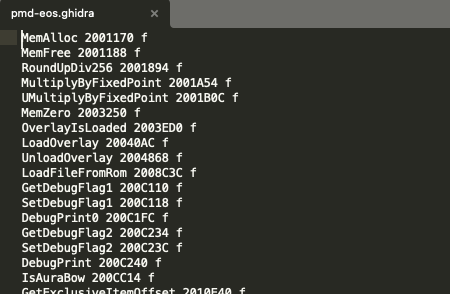

5. You should now see symbol names in the code listing and the decompiler:

   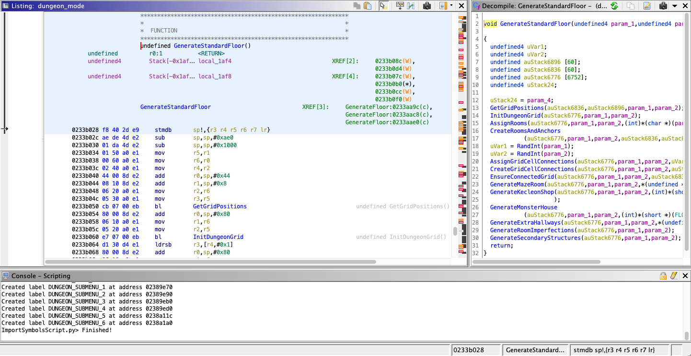

### C headers (types and function signatures)
Importing C headers is best done after importing symbols, so make sure you've followed the steps in the [previous section](#symbols) before proceeding with this section.

1. Download `headers.zip` from the [latest release package](https://github.com/UsernameFodder/pmdsky-debug/releases/latest) and extract the archive.
2. Open the C parser in the menu with File > Parse C Source...
3. Configure the appropriate settings:
    1. For the parse configuration, select `generic_clib_32.prf` (`clib.prf` should work too). I haven't tested all of the default profiles, but this one is most aligned with the `pmdsky-debug` C headers.
    2. Remove all the existing "Source files to parse" by highlighting them all and hitting the red 'x' button (`pmdsky-debug`'s headers are standalone, so this would just be extra cruft). Then hit the green '+' button and select `pmdsky.h` from the `pmdsky-debug` headers package. After this step, `pmdsky.h` should be the only file in the list.
    3. Leave the parse options as the defaults.
4. Click "Parse to Program" and the confirmations in the popups that follow to begin parsing. Some notes:
    1. Annoyingly, sometimes the "Parsing C" loading window can pop up before you've hit all the confirmations, and actually obscure a confirmation window. Make sure you check that there's nothing behind this window (otherwise you'll be waiting forever).
    2. The Ghidra parser is _slow_, and parsing can easily take over an hour (mainly because the `dungeon.h` header file is so large), so after you've started the parser and see the "Parsing C" loading window (it might be hidden by the configuration window), I recommend doing something else in the meantime while you wait. Alternatively, if you don't need the dungeon struct (or you've loaded it previously and nothing has changed), you can add `-DOMIT_LARGE_FILES` to the "Parse Options" box to skip parsing that file, which should reduce the load time to a few seconds.

       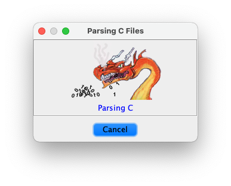

5. You should now be able to view and edit imported types and function signatures in the data type manager (Window > Data Type Manager, if it's not already open).

   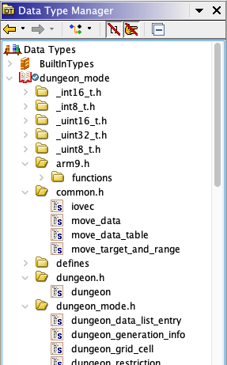

6. Right click on your project's archive in the data type manager (the one labeled with the program name you specified when setting up the project; "dungeon_mode" in the above image) and select "Apply Function Data Types". This will match the function signatures from the C headers with the function symbols you imported in the [previous section](#symbols), and apply parameter names and types to them.
7. You should now see additional parameter information (types and names) in the decompiler. Additionally, Ghidra should automatically propagate type information to other variables within functions where they can be inferred. Be aware that some registers in the assembly (in the code listing) will be bound to a parameter name for the duration of the function, even if the registers are repurposed throughout the function's execution.

   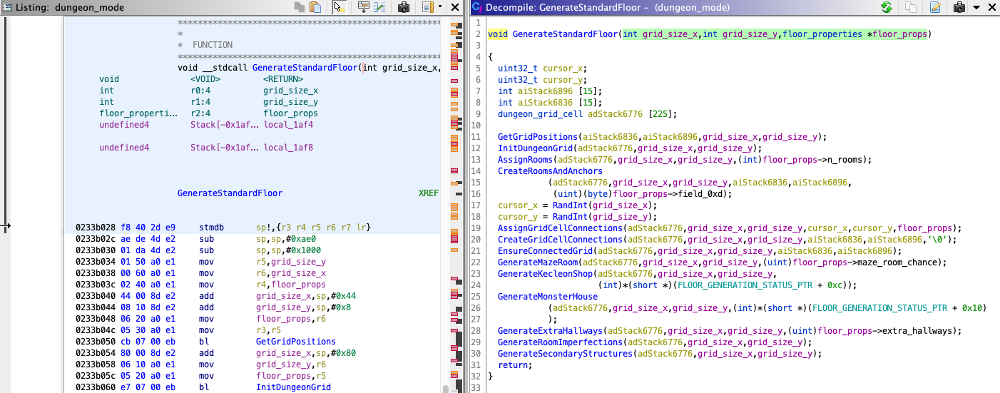

#### Applying types manually
Sometimes data types won't be assigned automatically in the decompiler, and you'll need to do it manually to get the full benefit of the imported types. In the decompiler, you can right-click on a variable and select "Retype Variable" (or sometimes "Retype Global") and specify the name of a type to manually apply to the variable in the decompiled code. This is most useful for struct pointers that haven't been automatically typed, since this allows the decompiler to show struct field accesses by name (e.g., `some_struct->some_named_field`) rather than as raw pointer operations (e.g., `*(some_pointer + some_offset)`).

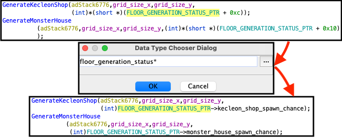

Similarly, you can also apply types to data labels in the code listing by right-clicking and selecting "Data" > "Choose Data Type...".

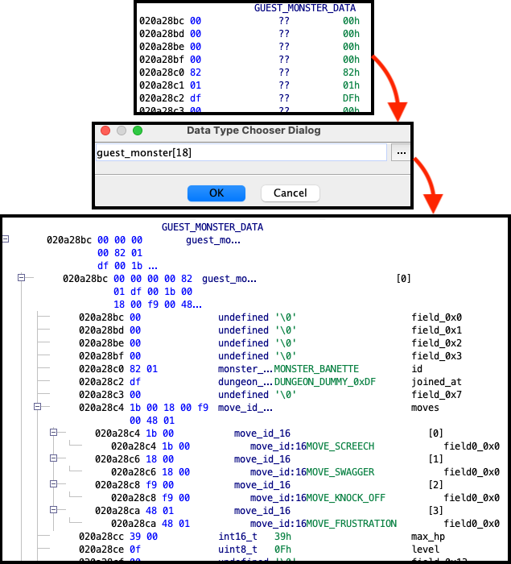

#### Enums
There are two ways to make use of enums: types and equates.

In some cases, the Ghidra decompiler can use type information to automatically resolve a constant value to its appropriate enum label. For example, in the `IsGoldenChamber` function, Ghidra automatically resolves the raw value of `3` and displays the more useful `MISSION_EXPLORE_WITH_CLIENT` (from `enum mission_type`).

However, automatic resolution might not always be possible. For example, the raw value of `2` in the `IsGoldenChamber` was not resolved. If the value of interest is stored in a local variable, you can try [applying the enum type manually](#applying-types-manually). Otherwise, you can use a Ghidra "equate". _Equates_ are a feature that allows you to associate an instance of a constant value with a name or enum label. You can assign an equate by right-clicking on the numeric value and selecting "Set Equate...", then selecting the enum you want to use to interpret the value. For example, in `IsGoldenChamber` the `2` should be interpreted using `enum mission_subtype_explore`. After applying the equate, the decompiler will show the enum label `MISSION_EXPLORE_GOLDEN_CHAMBER` rather than the raw value of `2`. You can follow the same procedure in the listing if you want equates to show up in the raw assembly instructions.

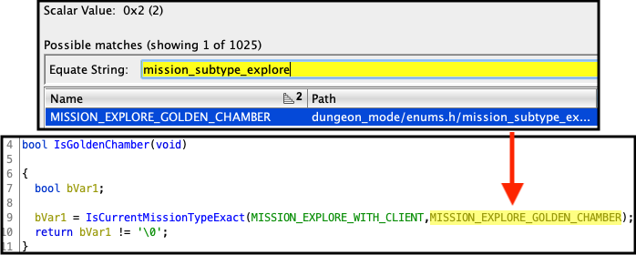

##### Workaround for enums in struct fields
One common case where automatic enum resolution fails is when the enum is a bitfield within a struct (see the [`headers/` README](../headers/README.md) for why things are done this way). Since the Ghidra decompiler [does not yet support bitfields](#bitfields), these fields won't be recognized or resolved to enum labels. Until this feature is added, you can use equates as described in the previous section.

Alternatively, if you really prefer automatic resolution, another workaround is to manually define a new, properly-sized enum (in the data type manager: Window > Data Type Manager) by copying the existing enum and changing the `Size` field in the editor, then editing the struct definition to use the properly-sized, non-bitfield enum for the relevant field. For example, you could create a new enum called `item_id_16` with a size of 2 bytes, then change `struct item::id` to be of type `item_id_16` rather than a bitfield of type `item_id` (which is normally defined to be 4 bytes). After doing this, the Ghidra decompiler should be able to automatically resolve enum labels when `struct item::id` is used (you can also use the resized enums as [types for certain data labels](#applying-types-manually)). Be aware that this may cause some conflicts with [subsequent debug info imports](#subsequent-imports).

#### Bitfields
_Explorers of Sky_ makes frequent use of bitfields. Ghidra supports bitfields in struct definitions, but they unfortunately don't yet work in the decompiler (support for them is "on the books", see [ghidra#2462](https://github.com/NationalSecurityAgency/ghidra/issues/2462) and [ghidra#647](https://github.com/NationalSecurityAgency/ghidra/issues/647)). This means that some struct fields might appear as undefined in the decompiler, even though they are defined in the struct definition. For example, the room flags bitfield at offset 0xD of `struct floor_properties` will show up as the Ghidra-default `field_0xd` in the decompiler.

This is something to be aware of while reading decompiled code. If a field looks undefined, don't forget to check the actual struct definition in the data type manager or the C headers to see if it's a bitfield. If this really bothers you, you can redefine that field (in the data type manager: Window > Data Type Manager) to a normal integer field with a name like `flags`. Be aware that this may cause some conflicts with [subsequent debug info imports](#subsequent-imports).

### Subsequent imports
As `pmdsky-debug` is updated, you might want to import the latest debug information into your project. Ghidra is pretty good about checking for repeated information when you import things, so if you've already imported a previous version of the debug info, you should be able to just follow the above steps for importing symbols and headers with the latest `pmdsky-debug` package to add incremental changes. (Although if there are changes to existing things in the debug info rather than just new additions, you might have to do some manual cleanup afterwards.)

If there have been no changes to `dungeon.h` since the last time you imported the C headers, you can also add `-DOMIT_LARGE_FILES` to the "Parse Options" box. This will skip importing `dungeon.h`, which should reduce import times significantly (from about an hour to a few seconds).

## No$GBA
The No$GBA debugger supports loading symbol names from a `.sym` file.

1. Download `symbols-sym.zip` from the [latest release package](https://github.com/UsernameFodder/pmdsky-debug/releases/latest) and extract the archive.
2. Locate the ROM file that you will be running in No$GBA, and create a text file in the same folder with the same name, but with the `.sym` extension. For example, if your ROM was called `pmd-eos.nds`, you should create a text file called `pmd-eos.sym`, and the folder should look like this in the file explorer:

   

3. Figure out which [overlays](overlays.md) will be loaded during the gameplay that you're debugging with No$GBA. Copy the contents of all the corresponding `.sym` files from the `pmdsky-debug` archive (pick the version subdirectory that matches your ROM) into the `.sym` file you just created, concatenating the lines of the different files together. Along with the overlays, you'll always want to include the contents of `arm9.yml`, and if relevant you might also want to include the contents of `ram.yml`. For example, a `.sym` file for a North American ROM might look like this:

   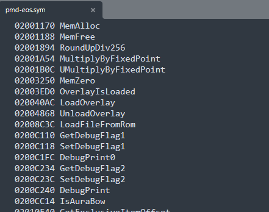

4. Load the ROM in No\$GBA! The debugger will automatically detect the `.sym` file and load it, and symbol name annotations will appear alongside the assembly instructions when debugging:

   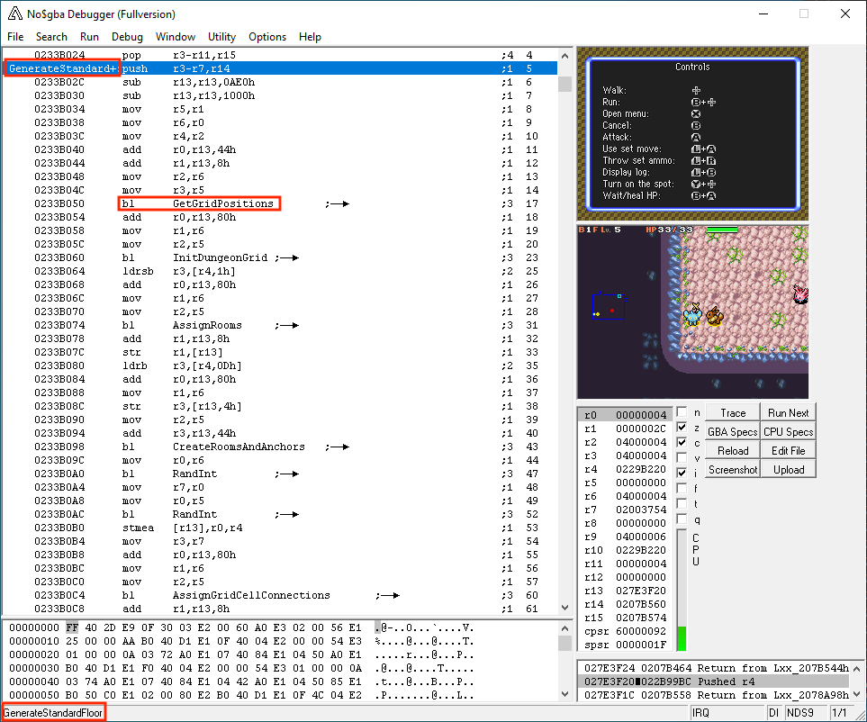
